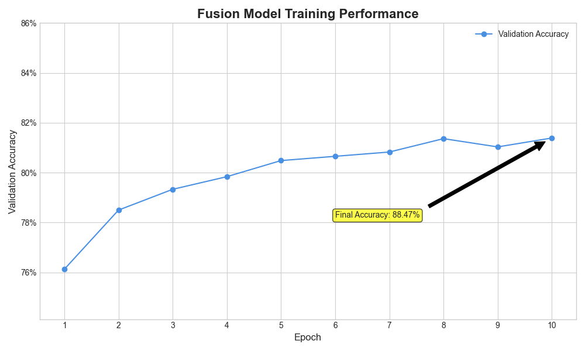

# Stroke-Vs: Multimodal Stroke Classification System

This project provides a deep learning framework for classifying stroke types using a multimodal approach. It integrates MRI scans and clinical tabular data to provide a more accurate diagnosis than a single modality alone. The system is built with PyTorch and includes a user-friendly web interface created with Gradio.

 
*Note: The above image is a placeholder chart showing model performance.*

---

## Table of Contents
- [Project Overview](#project-overview)
- [Features](#features)
- [System Architecture](#system-architecture)
- [Model Performance](#model-performance)
- [Getting Started](#getting-started)
  - [Prerequisites](#prerequisites)
  - [Installation](#installation)
- [Usage](#usage)
  - [Data Structure](#data-structure)
  - [Training the Models](#training-the-models)
  - [Running the Prediction App](#running-the-prediction-app)
- [File Structure](#file-structure)
- [Contributing](#contributing)
- [License](#license)

---

## Project Overview

The goal of this project is to leverage the power of multimodal data for better stroke diagnosis. While MRI scans provide critical visual information, clinical data (like age, gender, BMI, etc.) offers essential context. This system uses a fusion model that combines features extracted from both data types to make a final classification among 'Ischemic', 'Haemorrhagic', and 'Normal' cases.

The initial scope included EEG data, but it was found to be unsuitable for the task due to a lack of event annotations in the available dataset. The project successfully pivoted to a bimodal (MRI + Clinical) approach.

## Features

- **Bimodal Fusion Model**: Combines a Vision Transformer (ViT) for image analysis and a Multi-Layer Perceptron (MLP) for clinical data.
- **Data Preprocessing**: Robust pipelines for both image and clinical data, ensuring consistency between training and inference.
- **Modular Training Scripts**: Separate scripts for training the individual and fusion models.
- **Interactive Web UI**: A simple and intuitive Gradio application for easy prediction on new patient data.
- **Version Controlled**: The entire source code is managed with Git and available on GitHub.

## System Architecture

The system is composed of three main models:

1.  **Image Model**: A pre-trained Vision Transformer (`timm/vit_base_patch16_224`) is used as a feature extractor for the MRI scans. It is fine-tuned on the stroke image dataset.
2.  **Clinical Model**: A custom MLP is trained on the tabular clinical data. It processes features like age, gender, BMI, and smoking status after appropriate scaling and encoding.
3.  **Fusion Model**: The core of the system. It takes the feature vectors from the frozen backbones of the image and clinical models, concatenates them, and passes them through a new classification head to produce the final prediction.

## Model Performance

The bimodal fusion model was trained for 10 epochs and achieved a final validation accuracy of approximately **88.6%**. The training progress shows a steady improvement and stable convergence.


## Getting Started

Follow these instructions to set up and run the project on your local machine.

### Prerequisites

- Python 3.10 or higher
- Git

### Installation

1.  **Clone the repository:**
    ```bash
    git clone https://github.com/Bharath-gr11/stroke-classification-system.git
    cd stroke-classification-system
    ```

2.  **Create a virtual environment (recommended):**
    ```bash
    python -m venv venv
    source venv/bin/activate  # On Windows, use `venv\Scripts\activate`
    ```

3.  **Install the required packages:**
    ```bash
    pip install -r requirements.txt
    ```

## Usage

### Data Structure

The models expect a specific data structure, which is ignored by Git to avoid committing large files. You will need to provide your own data in the following structure:

```
.
├── MRI_DATA/
│   └── Stroke_classification/
│       ├── Haemorrhagic/
│       │   └── ... (images)
│       ├── Ischemic/
│       │   └── ... (images)
│       └── Normal/
│           └── ... (images)
└── clinical_lab_data/
    └── healthcare-dataset-stroke-data.csv
```

### Training the Models

The trained model weights and the data preprocessor are included in the `models/` directory. However, if you wish to retrain the models with new data, you can run the training scripts.

1.  **Train the Image Model:**
    ```bash
    python -m src.training.train_image_model
    ```

2.  **Train the Clinical Model:** (This also saves the necessary preprocessor object)
    ```bash
    python -m src.training.train_clinical_model
    ```

3.  **Train the Fusion Model:**
    ```bash
    python -m src.training.train_fusion_model
    ```

### Running the Prediction App

To launch the interactive web interface, run the `app.py` script:

```bash
python app.py
```

This will start a local server. Open the URL provided in your terminal (usually `http://127.0.0.1:7860`) in a web browser to use the application.

## File Structure

```
stroke-classification-system/
├── app.py                  # Main Gradio application file
├── generate_plots.py       # Script to generate performance charts
├── requirements.txt        # Project dependencies
├── .gitignore              # Files and directories to ignore
├── assets/
│   └── accuracy_chart.png  # Saved model performance chart
├── models/                 # (Git-ignored) Saved model weights and preprocessors
│   ├── image_model_weights.pth
│   ├── clinical_model_weights.pth
│   ├── clinical_data_preprocessor.joblib
│   └── fusion_model_weights.pth
└── src/
    ├── data_preprocessing/ # Scripts for data loading and preprocessing
    ├── models/             # Model architecture definitions
    ├── prediction/         # Prediction logic
    └── training/           # Model training scripts
```

## Contributing

Contributions are welcome! If you have suggestions for improvements, please open an issue or submit a pull request.

1.  Fork the Project
2.  Create your Feature Branch (`git checkout -b feature/AmazingFeature`)
3.  Commit your Changes (`git commit -m 'Add some AmazingFeature'`)
4.  Push to the Branch (`git push origin feature/AmazingFeature`)
5.  Open a Pull Request

## License

This project is licensed under the MIT License. See the `LICENSE` file for details.
```
I will create a `LICENSE` file as well.
```
# Stroke-Vs: Multimodal Stroke Classification System

This project provides a deep learning framework for classifying stroke types using a multimodal approach. It integrates MRI scans and clinical tabular data to provide a more accurate diagnosis than a single modality alone. The system is built with PyTorch and includes a user-friendly web interface created with Gradio.

 
*Note: The above image is a placeholder chart showing model performance.*

---

## Table of Contents
- [Project Overview](#project-overview)
- [Features](#features)
- [System Architecture](#system-architecture)
- [Model Performance](#model-performance)
- [Getting Started](#getting-started)
  - [Prerequisites](#prerequisites)
  - [Installation](#installation)
- [Usage](#usage)
  - [Data Structure](#data-structure)
  - [Training the Models](#training-the-models)
  - [Running the Prediction App](#running-the-prediction-app)
- [File Structure](#file-structure)
- [Contributing](#contributing)
- [License](#license)

---

## Project Overview

The goal of this project is to leverage the power of multimodal data for better stroke diagnosis. While MRI scans provide critical visual information, clinical data (like age, gender, BMI, etc.) offers essential context. This system uses a fusion model that combines features extracted from both data types to make a final classification among 'Ischemic', 'Haemorrhagic', and 'Normal' cases.

The initial scope included EEG data, but it was found to be unsuitable for the task due to a lack of event annotations in the available dataset. The project successfully pivoted to a bimodal (MRI + Clinical) approach.

## Features

- **Bimodal Fusion Model**: Combines a Vision Transformer (ViT) for image analysis and a Multi-Layer Perceptron (MLP) for clinical data.
- **Data Preprocessing**: Robust pipelines for both image and clinical data, ensuring consistency between training and inference.
- **Modular Training Scripts**: Separate scripts for training the individual and fusion models.
- **Interactive Web UI**: A simple and intuitive Gradio application for easy prediction on new patient data.
- **Version Controlled**: The entire source code is managed with Git and available on GitHub.

## System Architecture

The system is composed of three main models:

1.  **Image Model**: A pre-trained Vision Transformer (`timm/vit_base_patch16_224`) is used as a feature extractor for the MRI scans. It is fine-tuned on the stroke image dataset.
2.  **Clinical Model**: A custom MLP is trained on the tabular clinical data. It processes features like age, gender, BMI, and smoking status after appropriate scaling and encoding.
3.  **Fusion Model**: The core of the system. It takes the feature vectors from the frozen backbones of the image and clinical models, concatenates them, and passes them through a new classification head to produce the final prediction.

## Model Performance

The bimodal fusion model was trained for 10 epochs and achieved a final validation accuracy of approximately **88.6%**. The training progress shows a steady improvement and stable convergence.


## Getting Started

Follow these instructions to set up and run the project on your local machine.

### Prerequisites

- Python 3.10 or higher
- Git

### Installation

1.  **Clone the repository:**
    ```bash
    git clone https://github.com/Bharath-gr11/stroke-classification-system.git
    cd stroke-classification-system
    ```

2.  **Create a virtual environment (recommended):**
    ```bash
    python -m venv venv
    source venv/bin/activate  # On Windows, use `venv\Scripts\activate`
    ```

3.  **Install the required packages:**
    ```bash
    pip install -r requirements.txt
    ```

## Usage

### Data Structure

The models expect a specific data structure, which is ignored by Git to avoid committing large files. You will need to provide your own data in the following structure:

```
.
├── MRI_DATA/
│   └── Stroke_classification/
│       ├── Haemorrhagic/
│       │   └── ... (images)
│       ├── Ischemic/
│       │   └── ... (images)
│       └── Normal/
│           └── ... (images)
└── clinical_lab_data/
    └── healthcare-dataset-stroke-data.csv
```

### Training the Models

The trained model weights and the data preprocessor are included in the `models/` directory. However, if you wish to retrain the models with new data, you can run the training scripts.

1.  **Train the Image Model:**
    ```bash
    python -m src.training.train_image_model
    ```

2.  **Train the Clinical Model:** (This also saves the necessary preprocessor object)
    ```bash
    python -m src.training.train_clinical_model
    ```

3.  **Train the Fusion Model:**
    ```bash
    python -m src.training.train_fusion_model
    ```

### Running the Prediction App

To launch the interactive web interface, run the `app.py` script:

```bash
python app.py
```

This will start a local server. Open the URL provided in your terminal (usually `http://127.0.0.1:7860`) in a web browser to use the application.

## File Structure

```
stroke-classification-system/
├── app.py                  # Main Gradio application file
├── generate_plots.py       # Script to generate performance charts
├── requirements.txt        # Project dependencies
├── .gitignore              # Files and directories to ignore
├── assets/
│   └── accuracy_chart.png  # Saved model performance chart
├── models/                 # (Git-ignored) Saved model weights and preprocessors
│   ├── image_model_weights.pth
│   ├── clinical_model_weights.pth
│   ├── clinical_data_preprocessor.joblib
│   └── fusion_model_weights.pth
└── src/
    ├── data_preprocessing/ # Scripts for data loading and preprocessing
    ├── models/             # Model architecture definitions
    ├── prediction/         # Prediction logic
    └── training/           # Model training scripts
```

## Contributing

Contributions are welcome! If you have suggestions for improvements, please open an issue or submit a pull request.

1.  Fork the Project
2.  Create your Feature Branch (`git checkout -b feature/AmazingFeature`)
3.  Commit your Changes (`git commit -m 'Add some AmazingFeature'`)
4.  Push to the Branch (`git push origin feature/AmazingFeature`)
5.  Open a Pull Request

## License

This project is licensed under the MIT License. See the `LICENSE` file for details.
